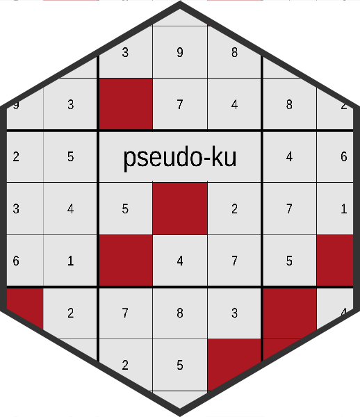

<!-- README.md is generated from README.Rmd. Please edit that file -->

# pseudo-ku 

<!-- badges: start -->

[](https://www.tidyverse.org/lifecycle/#experimental)
[](https://github.com/rtjohnson12/pseudoku)
<!-- badges: end -->

The goal of pseudoku is to …

## Installation

You can install the development version from
[GitHub](https://github.com/) with:

``` r
# install.packages("devtools")
devtools::install_github("rtjohnson12/pseudoku")
```

## Example

This is a basic example which shows you how to solve a common problem:

``` r
library(pseudoku)

board <- create_board(.seed = 42)
print_board(board)
```


